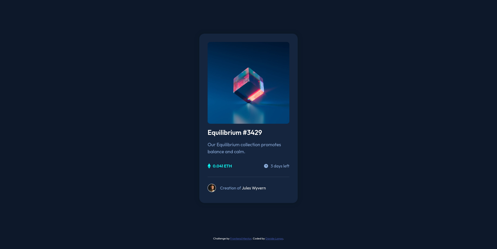
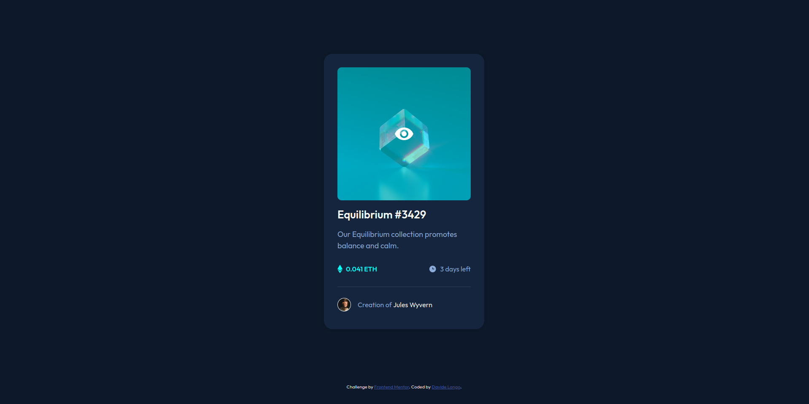
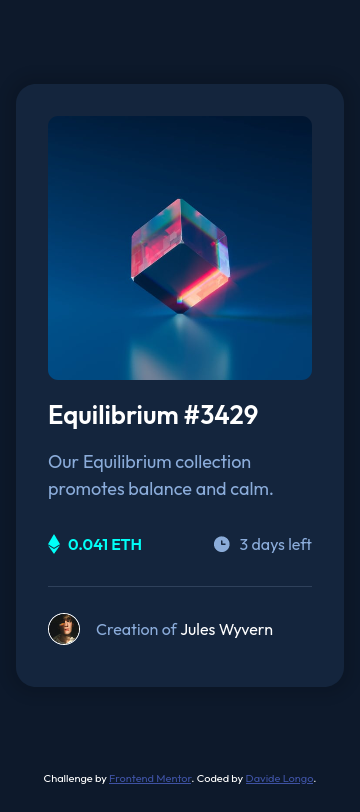

# Frontend Mentor - NFT preview card component solution

This is a solution to the [NFT preview card component challenge on Frontend Mentor](https://www.frontendmentor.io/challenges/nft-preview-card-component-SbdUL_w0U). Frontend Mentor challenges help you improve your coding skills by building realistic projects. 

## Table of contents

- [Overview](#overview)
  - [The challenge](#the-challenge)
  - [Screenshot](#screenshot)
  - [Links](#links)
- [My process](#my-process)
  - [Built with](#built-with)
  - [What I learned](#what-i-learned)
  - [Useful resources](#useful-resources)
- [Author](#author)

## Overview

### The challenge

Users should be able to:

- View the optimal layout depending on their device's screen size
- See hover states for interactive elements

### Screenshot

### Links

- [Solution URL](https://github.com/davidelng/6-nft-preview-card-component)
- [Live Site URL](https://davidelng.github.io/6-nft-preview-card-component/)

## My process

### Built with

- Semantic HTML5 markup
- CSS custom properties
- Flexbox
- Mobile-first workflow
- JavaScript

### What I learned

- How to make an overlay
- I also added a very little script to view the full-sized image when clicking on the preview

### Useful resources

- [W3C](https://www.w3schools.com/howto/howto_css_image_overlay.asp) - a simple guide to create a color overlay

## Author

- Frontend Mentor - [@davidelng](https://www.frontendmentor.io/profile/davidelng)
